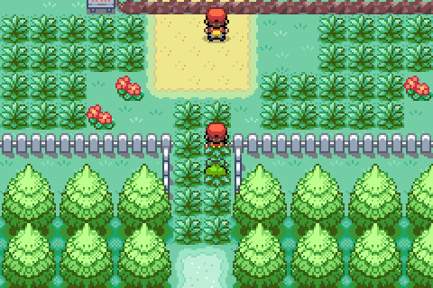
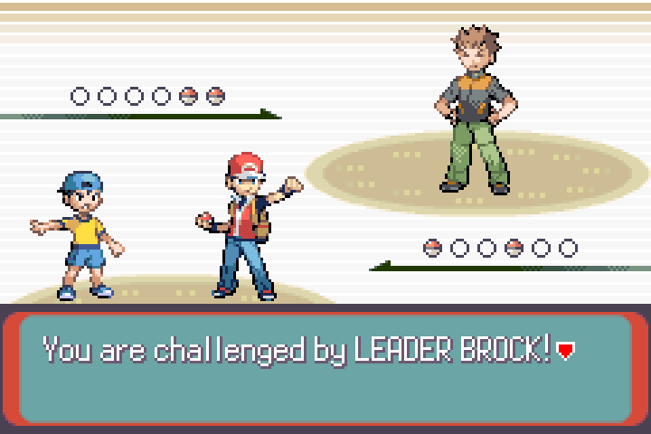
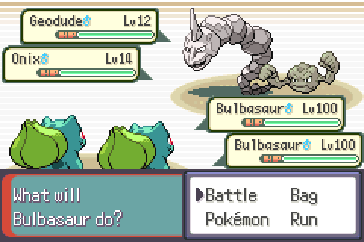
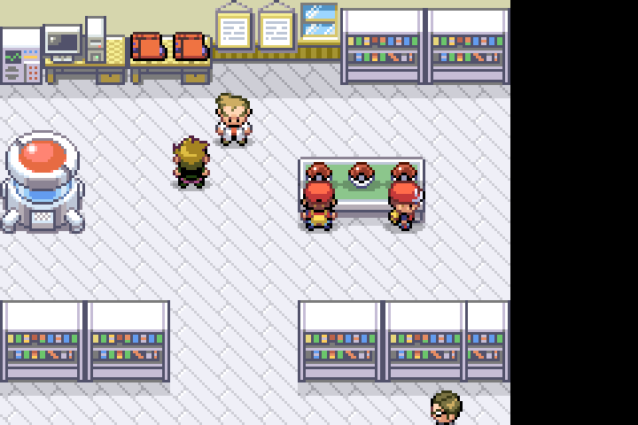

# Pokémon FireRed Co-Op

Play Pokémon FireRed with a friend — together, in real time.

Two players explore Kanto simultaneously. You see each other on the map, beat trainers as a team, and fight gym leaders side-by-side in true co-op double battles. Wild Pokémon are randomized from the full national dex using a shared seed, so you're both discovering the same surprises.

---

## Explore together

Your partner appears as a real character on your screen. Watch them walk around, run into tall grass, and wander into a different town entirely.

<p align="center">
  
</p>

Both players move independently — you can be on completely different maps at the same time. The ghost NPC appears and disappears as your partner enters or leaves your area.

---

## Fight gym leaders as a team

When both players approach a gym leader, the battle automatically becomes a **co-op double battle**. Each player brings their own Pokémon and controls their own side.

<p align="center">
  
</p>

<p align="center">
  
</p>

Both players see the same battle, make their own move choices, and the turn doesn't resolve until both have selected. RNG is synchronised so the same damage rolls land on both screens.

---

## Choose your starter together

Both players pick from Oak's three starters in the same room. Once someone claims a Pokémon, it's locked — your partner can't pick the same one. The rival gets whichever starter neither of you chose.

<p align="center">
  
</p>

---

## Features at a glance

| | |
|---|---|
| 👥 Real-time ghost NPC | See your partner move around the map live |
| 🎮 True co-op double battles | Both players fight gym leaders together |
| 🎲 Shared randomized encounters | Full national dex, same seed for both players |
| 🏆 Shared world state | Beat a trainer once — it counts for both |
| ⚡ Disconnect recovery | Ghost despawns in <0.5s; reconnect and resume |
| 💾 Auto-checkpoint saves | Saves on every map transition while connected |

---

## How to play

1. One player clicks **Host** and shares the room code
2. The other clicks **Join** and enters the code
3. Both press New Game and head to Oak's lab

No port-forwarding, no emulator setup, no technical knowledge required. Download the app and play.

---

## Technical details

<details>
<summary>Architecture, building, and testing</summary>

### Architecture

```
Player 1 (Tauri)                        Player 2 (Tauri)
┌────────────────────┐                  ┌────────────────────┐
│  pokefirered.gba   │                  │  pokefirered.gba   │
│  (libmgba)         │                  │  (libmgba)         │
│                    │                  │                    │
│  gMpSendRing ──────┼──► serial   ─────┼──► gMpRecvRing     │
│  gMpRecvRing ◄─────┼── bridge   ◄─────┼─── gMpSendRing     │
└────────────────────┘  (WebSocket)     └────────────────────┘
          │                                       │
          └──────────────┐       ┌────────────────┘
                         ▼       ▼
                   PartyKit relay server
          (pokefirered-coop.thereuben.partykit.dev)
```

The ROM uses two ring buffers in EWRAM (`gMpSendRing`, `gMpRecvRing`). The Tauri app's `serial_bridge.rs` polls them at ~60fps via libmgba memory reads/writes and forwards raw bytes over WebSocket to the relay server, which fans them out to the partner.

### Building the ROM

Requires devkitARM. See [INSTALL.md](INSTALL.md) for toolchain setup.

```bash
make firered -j$(nproc)
```

Output: `pokefirered.gba`.

### Running the relay server locally

```bash
cd relay-server/
npm install
npx partykit dev    # starts at ws://localhost:1999
```

Override the relay URL in the Tauri app:

```bash
COOP_RELAY_URL=ws://localhost:1999/parties/main cargo tauri dev
```

### Running the Tauri app

```bash
cd tauri-app/
npm install
cargo tauri dev     # development build with hot reload
cargo tauri build   # release build
```

### Testing with Claude Code (MCP)

```bash
claude mcp add --scope project gamestate -- python3 tools/mcp_gamestate/server.py
make build-states
```

Available tools: `start_emulator`, `stop_emulator`, `screenshot`, `press_button`, `wait`, `load_savestate`. Instances `p1` and `p2` relay packets automatically.

### Project structure

```
src/multiplayer.c              Core co-op logic (1700+ lines)
include/multiplayer.h          Packet format, ring buffer API, state struct
include/constants/multiplayer.h  Packet type constants
src/event_data.c               FlagSet/VarSet hooks for flag sync
data/maps/*/scripts.inc        Per-map event scripts (boss triggers, Oak's lab)

tools/mcp_gamestate/           Headless mGBA MCP server for Claude Code testing
test/lua/states/               Pre-built save states for automated testing

relay-server/src/server.ts     PartyKit relay server (302 lines)
tauri-app/src-tauri/           Rust backend: libmgba FFI, ring buffer bridge, WebSocket
tauri-app/src/                 React frontend: host/join UI, game screen
```

### Status

| Feature | Status |
|---|---|
| Ghost NPC + position sync | ✅ |
| Follower Pokémon ghost | ✅ |
| Co-op starter selection | ✅ |
| Trainer / story flag sync | ✅ |
| Randomized wild encounters (shared seed) | ✅ |
| Boss readiness + co-op double battles | ✅ |
| Turn sync + RNG lockstep | ✅ |
| Disconnect detection + ghost despawn | ✅ |
| Battle grace timer / reconnect | ✅ |
| Auto-checkpoint save on map change | ✅ |
| Tauri desktop app | 🔧 built, needs E2E test |
| PartyKit relay deployment | 🔧 built, needs deployment |

For full architecture and implementation guidelines see [CLAUDE.md](CLAUDE.md).

</details>
